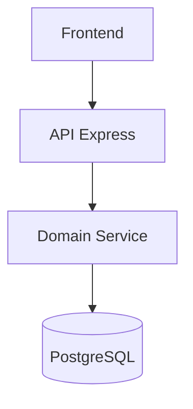
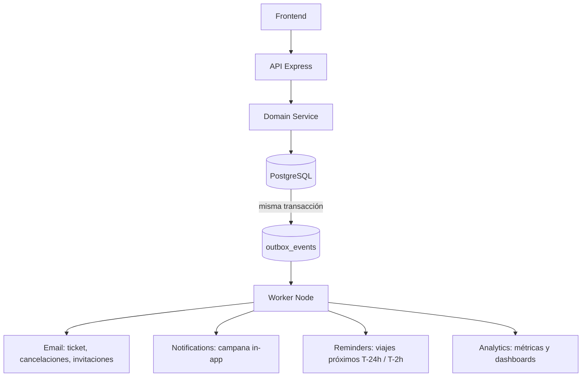

# WKR-002 — ADR: Arquitectura de eventos y workers

**Tipo:** ADR (Architecture Decision Record)
**Fecha:** 2026-08-04
**Estado:** Propuesto (pendiente de aprobación antes de implementar)
**Referencia:** [WKR-001](WKR-001-event-inventory-audit.md), [ROADMAP.md](ROADMAP.md) Fase 3, [ADR-001](decisions/ADR-001-boarding-cross-agency.md)

---

## 1. Contexto

### Problema actual

El sistema **no tiene infraestructura de eventos**: no hay eventos de dominio explícitos, cola, broker ni workers. Los efectos secundarios (emails, notificaciones, generación de tickets) se ejecutan dentro del ciclo HTTP:

- **Síncronos:** el ticket PNG (satori + resvg) se genera en `reservation.service.ts` **después del commit** y puede romper la respuesta.
- **Fire-and-forget** (`.catch` + `console.error`): emails y notificaciones se pierden silenciosamente si fallan. Sin retry ni DLQ.
- **Timers embebidos:** `setInterval` en `backend/src/index.ts` (locks cada 60 s, auto-completado de viajes cada hora), con un cron de Edge Function que no está versionado.

La tabla `notifications` **no funciona como outbox**: es una materialización síncrona sin máquina de entrega (sin `delivered_at`, retries, estado de envío ni actor).

### Por qué se necesita procesamiento asíncrono

1. **Confiabilidad:** un fallo de email o de render no debe perder tickets ni notificaciones.
2. **Latencia:** el request no debe esperar por CPU pesada (PNG) ni por loops de email por agencia.
3. **Consistencia:** "la reserva existe" y "el ticket fue entregado" son hechos distintos; hoy se tratan como un solo paso fallible.
4. **Trabajo programado durable:** locks, auto-completado, recordatorios y limpieza no deben morir con la API.

### Limitaciones del modelo actual

- Sin retries, backoff ni DLQ.
- Sin idempotencia entre consumidores (solo guard `ticket_email_sent_at`).
- Scheduler no durable ni seguro multi-instancia; sin historial de ejecución.
- Dominio acoplado a los canales de entrega (`email.service`, `notification.service`).

### Casos que motivan la arquitectura

- **Emails:** tickets, confirmaciones, cancelaciones, invitaciones, reset de contraseña.
- **Generación de tickets:** PNG del boleto (CPU pesada) fuera del request.
- **Notificaciones:** fan-out a agencias y superadmin sin bloquear el HTTP.
- **Recordatorios:** viajes próximos (T-24h/T-2h) para pasajeros y agencias.
- **Tareas programadas:** auto-completado de viajes, locks, métricas nocturnas.
- **Limpieza automática:** retención de `boarding_attempts` (90 días), purga de eventos procesados.

---

# 2. Decisión arquitectónica

**Adoptar: Transactional Outbox + Workers independientes.**

El dominio registra eventos **dentro de la misma transacción** que cambia el estado principal. Un worker posterior lee el outbox y ejecuta los efectos secundarios de forma confiable.

### Ejemplo — Reserva creada

```
BEGIN
  INSERT reservation (...)
  INSERT reservation_passengers (...)
  UPDATE seats SET status='reserved' ...
  INSERT outbox_events (event_type='reservation.created', aggregate_id=..., payload=...)
COMMIT

Después:
  Worker (relay) → lee outbox_events pendientes
                 → procesa reservation.created
                 → envía email del ticket
                 → crea notificación
                 → alimenta métricas
```

**Garantía clave:** el evento se persiste en la misma transacción que el cambio de estado → "si el estado cambió, el evento existe". No hay doble escritura manual ni ventana de pérdida.

---

# 3. Decisiones NO tomadas

## No Event Sourcing

- No necesitamos reconstrucción histórica completa del estado.
- Necesitamos **confiabilidad de efectos secundarios**, no reproducibilidad de estado.
- El estado vive en tablas normales (`reservations`, `reservation_passengers`, `seats`, `trips`) como fuente de verdad.
- El outbox es entrega garantizada, no un log de reconstrucción.

## No broker inicialmente

**No introducir todavía:** Kafka, RabbitMQ, Redis/BullMQ.

- Complejidad innecesaria para el tamaño actual.
- Validar primero las necesidades reales (volumen de emails, fan-out, latencia).
- Postgres como cola cubre el caso inicial con consistencia transaccional.

## No microservicios

Los workers serán **procesos separados dentro del mismo ecosistema** (mismo repo, mismo despliegue, misma base de datos, mismas reglas service_role/RLS). No se fragmenta el dominio.

---

# 4. Arquitectura propuesta

## Flujo síncrono (actual)



## Flujo con eventos (objetivo)



---

# 5. Modelo conceptual del Outbox

**Tabla futura `outbox_events`** — solo diseño, **no es una migración todavía**:

| Campo | Tipo | Descripción |
|---|---|---|
| `id` | UUID PK | Identificador único del evento |
| `event_type` | TEXT | Nombre del evento (`reservation.created`, `trip.cancelled`, ...) |
| `aggregate_type` | TEXT | Tipo del agregado (reservation, trip, passenger, agency, user, seat) |
| `aggregate_id` | UUID | Identificador del agregado origen |
| `payload` | JSONB | Datos del evento (contexto multi-tenant + datos específicos) |
| `status` | TEXT | `pending` / `processing` / `completed` / `failed` |
| `attempts` | INT | Contador de intentos de procesamiento |
| `available_at` | TIMESTAMPTZ | Momento desde el que puede procesarse (backoff) |
| `created_at` | TIMESTAMPTZ | Fecha de creación (espeja `occurred_at`) |
| `processed_at` | TIMESTAMPTZ | Fecha en que se completó |
| `last_error` | TEXT | Último error de procesamiento |

Reglas:
- `pending` al insertarse en la misma transacción del negocio; el worker marca `processing` → `completed` / `failed`.
- Índice recomendado: `(status, available_at)` para polling eficiente.
- Retención: el `RetentionWorker` purga `completed` tras un período definido (30–90 días).

---

# 6. Contrato de eventos

Todo evento **debe** tener:

```typescript
interface DomainEvent {
  id: string;            // UUID único del evento
  type: string;          // 'reservation.created'
  version: number;       // versión del esquema del evento (empezar en 1)
  aggregateId: string;   // id de la entidad origen
  tenantId: string;      // agency_id cuando aplique (multi-tenancy)
  occurredAt: string;    // ISO 8601
  payload: Record<string, unknown>;
}
```

### Ejemplos

```json
{ "type": "reservation.created", "version": 1, "aggregateId": "res-123",
  "tenantId": "ag-456", "occurredAt": "2026-08-04T14:30:00Z",
  "payload": { "trip_id": "trip-789", "seat_ids": [...], "booker_name": "..." } }

{ "type": "trip.cancelled", "version": 1, "aggregateId": "trip-789",
  "tenantId": "ag-456", "occurredAt": "2026-08-04T15:00:00Z",
  "payload": { "reason": "..." } }

{ "type": "passenger.boarded", "version": 1, "aggregateId": "pas-321",
  "tenantId": "ag-456", "occurredAt": "2026-08-04T16:10:00Z",
  "payload": { "reservation_id": "res-123", "seat_id": "seat-111", "operator_agency_id": "ag-789" } }
```

### Hechos, no comandos

Los eventos son **hechos ocurridos**, inmutables; no intenciones ni órdenes.

- Incorrecto: `send_email` (es una orden a un canal de entrega).
- Correcto: `reservation.created` (es el hecho que **motiva** enviar el email).

El consumidor decide qué hacer; el productor no conoce a los consumidores.

---

# 7. Workers propuestos

### Arquitectura inicial

```
nomadas-api       → API Express (procesa requests, escribe outbox)
nomadas-worker    → Worker Node (consume outbox + scheduler)
```

**No múltiples workers todavía.** Un único proceso worker con despacho por tipo de job.

### Estructura interna del worker

```
jobs/
  email/           → consume reservation.created, trip.cancelled, invitation.created, ...
  notifications/   → fan-out in-app
  cleanup/         → scheduler: locks expirados, retención, purga de eventos
  reminders/       → scheduler: viajes próximos
```

### Responsabilidades

## Email Worker

- **Consume:** `reservation.created`, `trip.cancelled`, `trip.postponed`, `invitation.created`, `user.activated`.
- **Ejecuta:** render de plantillas, PNG del ticket, envío vía Resend, actualización de `ticket_email_sent_at` (idempotente).

## Cleanup Worker

- **Consume:** scheduler (cron).
- **Ejecuta:** liberación de locks expirados, purga de `boarding_attempts` (90 días), limpieza de `outbox_events` completados, datos temporales.

## Reminder Worker

- **Consume:** scheduler + `trip.updated`/`trip.postponed`/`trip.cancelled` (re-agendar).
- **Ejecuta:** generación de `trip.reminder_due` a bookers/agencias en ventanas T-24h y T-2h.

---

# 8. Scheduler

**Decisión:** los procesos programados **NO** deben vivir dentro del proceso HTTP.

### Actualmente

```typescript
// backend/src/index.ts
setInterval(releaseExpiredLocks, 60_000);
setInterval(completeExpiredTrips, 60 * 60 * 1000);
```

**Problemas:**
- **Múltiples instancias:** cada réplica ejecuta el mismo timer → carreras y solapamientos.
- **Pérdida al reiniciar:** si el proceso cae, los locks expiran y los viajes no se auto-completan.

### Futuro

```
scheduler (worker, proceso independiente)
   |
   |  genera jobs / eventos
   ▼
workers process (mismo proceso worker o cola)
```

El scheduler vive en `nomadas-worker` (o cron versionado), **nunca en la API**.

---

# 9. Idempotencia

Un evento **puede procesarse más de una vez** (retries, re-entrega, reinicios). Por eso:

- **`event_id` único:** cada evento tiene un `id` UUID inmutable.
- **Cada consumidor registra su procesamiento:** la unidad de idempotencia es `(consumidor, event_id)`.
- **Retries seguros:** reprocesar no produce efectos duplicados.

### Ejemplo — email enviado

```
event_id = X (reservation.created)
  → Email Worker envía ticket
  → registra: procesado (email) → event_id X

Si el evento vuelve a entregarse (retry/reenvío):
  → el worker consulta su registro de idempotencia
  → ya procesado → NO enviar nuevamente
```

Soporte:
- Unique constraint en el outbox (`id`; opcional `(event_type, aggregate_id)`).
- En consumidores con efectos externos: tabla de procesamiento o guard en datos (`ticket_email_sent_at`).

---

# 10. Retry y errores

### Estados del evento

```
pending ──► processing ──► completed
              │
              └──► failed (tras agotar intentos)
```

### Política

- **Máximo de intentos:** límite configurable (p. ej. 5 por evento).
- **Backoff:** retraso creciente (exponencial + jitter) vía `available_at`.
- **Registro del error:** `last_error` para diagnóstico.
- **DLQ (futuro):** eventos que exceden intentos se mueven a `outbox_events_dead` para inspección manual **sin pérdida de datos**.

---

# 11. Multi-tenancy

Todos los eventos **deben transportar contexto**: `tenantId`/`agency_id` cuando aplique, `trip_id`, `reservation_id`, `actor_id`.

### Separación de autoridad (respetar ADR-001)

- **Comercial:** `reservation.agency_id` = agencia propietaria. Solo ella administra la reserva por flujos administrativos.
- **Operacional:** `trip_agencies` = agencias que operan el boarding de un viaje compartido.

Consecuencias para workers:
- `passenger.boarded` distingue `operator_agency_id` (la que escaneó) de la propietaria (`reservation.agency_id`).
- Notificaciones/reportes se dirigen por propiedad comercial; las operaciones de boarding se autorizan por `trip_agencies`.
- Los workers usan **service_role** (BYPASSRLS) como el resto del backend; la autorización de negocio vive en la capa de aplicación.

---

# 12. Realtime vs Eventos

Son mecanismos **complementarios**, no competidores.

| | Realtime | Eventos de dominio |
|---|---|---|
| Significado | "algo cambió en una tabla" | "algo importante ocurrió en el dominio" |
| Naturaleza | cambio de fila (INSERT/UPDATE/DELETE) | hecho de negocio inmutable |
| Consumidor típico | Frontend (UX) | Workers, integraciones, métricas |
| Persistencia | efímera (sin cola) | `outbox_events` (persistente) |
| Ejemplo | fila `reservation_passengers.boarded=true` | `passenger.boarded` |

**Ejemplo:** `reservation.created` puede producir email, notificación y analytics — el evento es el origen. En paralelo, el realtime de `reservations` mantiene el dashboard actualizado.

**Realtime sigue existiendo para UX.** No se reemplaza: los suscriptores `postgres_changes` del frontend siguen funcionando sobre las tablas publicadas.

---

# 13. Opciones tecnológicas evaluadas

| Opción | Pros | Contras |
|---|---|---|
| **PostgreSQL Outbox + Worker Node** | Simple, consistente, usa el stack actual | Requiere polling/dispatcher propio |
| **Redis/BullMQ** | Retries maduros, prioridades, UI de colas | Nueva infraestructura a operar |
| **Supabase Edge Functions** | Integración nativa con Supabase | Menos control para procesos largos; límites de runtime |
| **Temporal** | Workflows complejos, durabilidad fuerte | Demasiado para la etapa actual |

**Conclusión:** mantener la decisión abierta hasta la implementación (WKR-003). El diseño del outbox es agnóstico al vehículo de dispatch.

---

# 14. Roadmap de implementación

| Iteración | Alcance |
|---|---|
| **WKR-003** | Transactional Outbox (tabla + publicador en servicios) |
| **WKR-004** | Primer worker de emails (consume `reservation.created`, retries, idempotencia) |
| **WKR-005** | Mover schedulers (locks expirados, auto-completado de viajes) fuera de `index.ts` |
| **WKR-006** | Recordatorios (`trip.reminder_due`, T-24h/T-2h) |
| **WKR-007** | Observabilidad (métricas de eventos, DLQ, retención) |

---

# 15. Consecuencias

## Positivas

- Requests más rápidos (el PNG, los emails y las notificaciones salen del ciclo HTTP).
- Retries e idempotencia → entrega confiable de efectos secundarios.
- Mejor observabilidad (estado de eventos, `last_error`, `attempts`).
- Escalabilidad: el worker escala de forma independiente de la API.

## Negativas

- Más componentes a operar (proceso worker, tabla de eventos).
- Necesidad de monitoreo (cola vacía, eventos en `failed`/DLQ).
- Consistencia eventual entre el estado y los efectos secundarios (el email puede llegar con retraso).

---

# 16. Validación final

- Documento creado.
- **Sin cambios de código.**
- **Sin migraciones.**
- **Sin dependencias nuevas.**

La arquitectura queda **preparada para implementar workers posteriormente** (WKR-003 en adelante), sin haber modificado el sistema actual.
