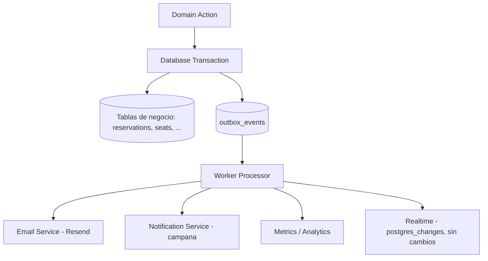

# WKR-003 — Transactional Outbox Foundation Design

**Tipo:** Diseño de fundación técnica (solo análisis y diseño documentado, sin implementación)
**Fecha:** 2026-08-05
**Referencia:** [WKR-001](WKR-001-event-inventory-audit.md), [WKR-002](WKR-002-events-workers-architecture-adr.md), [WKR-003.1](WKR-003.1-outbox-readiness-audit.md), [ADR-001](decisions/ADR-001-boarding-cross-agency.md), [ROADMAP.md](ROADMAP.md) Fase 3

---

# 1. Contexto y objetivo

## Problema actual

Nómadas Tour no tiene infraestructura de eventos. Los efectos secundarios de dominio se ejecutan dentro del ciclo HTTP, con dos defectos estructurales:

1. **Latencia y fallo parcial:** el ticket PNG (satori + resvg) se genera **después del commit** (`reservation.service.ts:170`); si falla, rompe la respuesta aunque la reserva ya exista.
2. **Pérdida silenciosa:** emails y notificaciones son fire-and-forget (`.catch` + `console.error`), sin retry ni DLQ. El email del ticket (`reservation.service.ts:224-239`) tiene un `.then` interno no enlazado al `.catch` externo → un fallo no se loguea.

Los timers `setInterval` embebidos (`index.ts:10-38`) no son durables ni multi-instancia seguros.

## Side effects dentro del ciclo HTTP

- Email de ticket con PNG (`reservation.service.ts:224-239`).
- Notificaciones in-app (`notification.service.ts:62-77`, best-effort).
- Emails masivos de viajes: loop por agencia en `superadmin.service.ts` (asignado `:477-507`, pospuesto `:1066-1095`, cancelado `:1298-1326`).
- Emails de invitación/registro/reset (`superadmin.service.ts:136`, `auth.service.ts:90,257`).
- Realtime: `postgres_changes` emitido por Supabase (se mantiene, es complemento).

## Necesidad del outbox

El outbox garantiza que **"si el estado cambió, el evento existe"**: el evento se persiste en la misma transacción que el cambio de negocio, y un worker posterior ejecuta los efectos secundarios con retry e idempotencia. Desacopla el dominio de la entrega.

## Relación con WKR-001 y WKR-002

- **WKR-001** inventarió 0 eventos formales, 10 tipos de notificación, `boarding_logs`, `boarding_attempts`, 2 crons no durables y 7 puntos de email.
- **WKR-002** decidió **Transactional Outbox + Workers** y diseñó el modelo conceptual de `outbox_events`, el contrato de eventos y los estados.
- **WKR-003.1** auditó readiness y recomendó comenzar con `reservation.created` en 4 fases incrementales.

Este documento convierte esas decisiones en el **diseño de fundación** que WKR-003 implementará después (tabla, contrato, publicación, idempotencia, estados).

---

# 2. Decisión arquitectónica

**Confirmar: Transactional Outbox + Workers.**

```
Dominio (service / RPC)
    │  misma transacción
    ▼
outbox_events ──► Worker (relay) ──► efectos externos (email, notif, métricas)
```

## Sin Event Sourcing

- El estado vive en tablas normales (`reservations`, `reservation_passengers`, `seats`, `trips`) como fuente de verdad.
- El outbox es **entrega garantizada de efectos secundarios**, no un log de reconstrucción.
- No hay proyecciones complejas ni CQRS que justifiquen reconstruir estado desde eventos.

## Sin Kafka / brokers externos todavía

- Volumen y fan-out actuales no lo exigen.
- Postgres como cola cubre el caso con consistencia transaccional (un solo sistema de escritura).
- BullMQ/Redis, Temporal, etc. se reevalúan cuando la demanda lo justifique (WKR-002, sección 13).

## Sin microservicios

- El worker es un **proceso separado del mismo ecosistema** (mismo repo, mismo despliegue, misma BD, service_role).
- No se fragmenta el dominio ni se duplican servicios.

## Sin mover lógica crítica fuera de transacciones

- `create_agency_reservation` (014/047) y `boarding_toggle` (046) siguen siendo atómicos e idempotentes.
- El outbox se escribe **dentro** de esas transacciones (o vía trigger), nunca en un request separado.

**Por qué:** confiabilidad inmediata (retries, DLQ, idempotencia) sin deuda de infraestructura nueva, aprovechando el stack Express + Supabase/PostgreSQL existente.

---

# 3. Modelo conceptual

```
Domain Action
      ↓
Database Transaction
      ↓
outbox_events
      ↓
Worker Processor
      ↓
External Effects
```



**Propiedades clave**

- El evento se persiste **en la misma transacción** que el cambio de estado.
- El worker lee `pending`, marca `processing`, ejecuta efectos y marca `completed`/`failed`.
- Fallos → reintentos con backoff → DLQ (futura).
- Retención y purge bajo `RetentionWorker`.

---

# 4. Diseño de tabla outbox_events

> NO se crea SQL todavía. Diseño de referencia para la migración futura.

| Campo | Propósito | Tipo recomendado | Índices |
|---|---|---|---|
| `id` | Identidad única del evento (idempotencia del consumidor) | `uuid` PK (default `gen_random_uuid()`) | PK |
| `event_type` | Nombre del hecho (`reservation.created`) | `text` | — |
| `event_version` | Versión del esquema del evento (contrato) | `int` (default 1) | — |
| `aggregate_type` | Tipo del agregado origen (`reservation`, `trip`, `passenger`, `agency`, `user`) | `text` | — |
| `aggregate_id` | Identificador del agregado origen | `uuid` | — |
| `agency_id` | Contexto multi-tenant (agencia propietaria comercial) | `uuid` (nullable) | sí (filtros por tenant) |
| `trip_id` | Contexto operacional (viaje afectado) | `uuid` (nullable) | sí |
| `actor_id` | Usuario que ejecutó la acción (auditoría) | `uuid` (nullable) | — |
| `payload` | Datos del evento (mínimo, ver sección 10) | `jsonb` | — |
| `status` | Máquina de estados: `pending`/`processing`/`completed`/`failed` | `text` con CHECK | **sí: `(status, available_at)`** (polling del relay) |
| `attempts` | Contador de intentos de procesamiento | `int` default 0 | — |
| `available_at` | Momento desde el que puede procesarse (backoff) | `timestamptz` default `now()` | (incluido en índice anterior) |
| `processed_at` | Fecha en que se completó | `timestamptz` (nullable) | — |
| `error_message` | Último error de procesamiento (diagnóstico) | `text` (nullable) | — |
| `created_at` | Fecha de creación (espeja `occurred_at`) | `timestamptz` default `now()` | — |

**Reglas adicionales**

- `event_type` + `aggregate_type` + `aggregate_id` como candidate para correlación de duplicados (ver sección 8).
- La tabla **no** se publica en realtime y queda accesible solo con `service_role` (BYPASSRLS); RLS restrictiva por defecto (ver sección 10).
- Retención: `completed` se purga tras 30-90 días; `failed` se conserva para inspección hasta decisión manual o DLQ.

---

# 5. Contrato de eventos

### Estructura JSON estándar

```json
{
  "id": "8f2a1c6e-9b3d-4c5e-8a1f-6d2b4e9c0a11",
  "type": "reservation.created",
  "version": 1,
  "occurred_at": "2026-08-05T14:30:00.000Z",
  "tenant": { "agency_id": "ag-0001" },
  "aggregate": { "type": "reservation", "id": "res-0001" },
  "data": {
    "trip_id": "trip-0001",
    "reservation_id": "res-0001",
    "booker_name": "Juan Pérez",
    "passenger_count": 2,
    "seat_codes": ["A1", "A2"],
    "send_ticket_email": true,
    "contact_email": "cliente@correo.com"
  }
}
```

Equivalencia con la fila de `outbox_events`:

| Contrato | Columna |
|---|---|
| `id` | `id` |
| `type` | `event_type` |
| `version` | `event_version` |
| `occurred_at` | `created_at` |
| `tenant.agency_id` | `agency_id` |
| `aggregate.type` | `aggregate_type` |
| `aggregate.id` | `aggregate_id` |
| `data` | `payload` |

### Versionado

- Cada `type` tiene `version` (empezar en 1).
- Un cambio **aditivo** (nuevo campo opcional en `data`) no cambia la versión.
- Un cambio **incompatible** (renombrar/eliminar campo, cambiar tipo) incrementa la versión; los consumidores soportan múltiples versiones o se migran con el evento.

### Compatibilidad futura

- Los consumidores validan `type + version` antes de procesar.
- Eventos de versiones desconocidas se reencolan o van a DLQ (nunca se silencian).
- El `data` solo crece con campos opcionales; nunca se reutiliza un campo con otro significado.

### Multi-tenancy

- `tenant.agency_id` viaja siempre que aplique; `null` para hechos globales (superadmin/system).
- `trip_id` y `actor_id` como contexto adicional en `data` (ver sección 10).
- Separación comercial (`reservation.agency_id`) vs operacional (`trip_agencies`) respetando ADR-001.

---

# 6. Primeros eventos candidatos

## Alta prioridad

### reservation.created

- **Productor actual:** `reservation.service.createAgencyReservation` (`reservation.service.ts:85-248`) vía RPC `create_agency_reservation`.
- **Momento de generación:** dentro del commit de la reserva (en el RPC o trigger sobre `reservations` INSERT con `status='confirmed'`).
- **Consumidores futuros:** EmailWorker (ticket + PNG), NotificationFanoutWorker (campana superadmin), métricas.
- **Riesgos:** duplicación de email si falla la idempotencia; el PNG ya no bloquea el request.

### reservation.cancelled

- **Productor actual:** `reservation.service.cancelAgencyReservation` (`:345-410`) y `updateReservationStatus` (superadmin, `:1341-1386`).
- **Momento:** dentro del UPDATE a `status='cancelled'` (service layer o trigger).
- **Consumidores futuros:** email al booker (hoy inexistente), liberación de asientos (hoy síncrona, se conserva), métricas.
- **Riesgos:** evento doble si se cancela desde dos caminos (agencia + superadmin) — requiere deduplicación por correlación.

### trip.created

- **Productor actual:** `superadmin.service.createTrip` (`:399-533`).
- **Momento:** tras insertar trip + seats + trip_agencies (fin de la secuencia de creación).
- **Consumidores futuros:** EmailWorker (fan-out por agencia, hoy loop en el request), notificación.
- **Riesgos:** el rollback manual actual (borrar trip/seats) complica emitir el evento dentro de una transacción — evaluar reescritura a transacción única en WKR-004.

### trip.cancelled

- **Productor actual:** `superadmin.service.updateTripStatus` (`:1232-1361`).
- **Momento:** dentro del UPDATE a `status='cancelled'` (service layer).
- **Consumidores futuros:** email por agencia, liberación de asientos (hoy síncrona, se conserva), re-agendar reminders.
- **Riesgos:** validaciones de ventana temporal previas; el evento debe emitirse solo si el UPDATE tiene efecto.

### trip.postponed

- **Productor actual:** `superadmin.service.updateTrip` con `postpone=true` (`:1045-1133`).
- **Momento:** dentro del UPDATE de `departure_time`/`postponed_from`.
- **Consumidores futuros:** email a agencias viejas + nuevas, notificación, re-agendar reminders.
- **Riesgos:** distinción "editado vs pospuesto" depende de `isRealPostpone` — el evento solo se emite en posposición real.

### passenger.boarded / passenger.unboarded

- **Productor actual:** RPC `boarding_toggle` (046) llamado por `reservation.service.toggleBoarding` (`:611-668`).
- **Momento:** dentro de la transacción del RPC (trigger o INSERT en `boarding_logs`).
- **Consumidores futuros:** notificación a la **agencia propietaria** (distinta de la operadora que escanea, ADR-001), métricas en vivo, historial.
- **Riesgos:** ya hay logs atómicos (`boarding_logs`); el evento debe distinguir `operator_agency_id` de `reservation.agency_id`.

---

# 7. Estrategia de publicación

## A) Services escribiendo eventos

El service layer, tras el commit, llama a `publishEvent()` en un request separado.

- **Pro:** simple, explícito, control de versión en TypeScript.
- **Contra:** **no es transaccional** — si el commit ocurre y el publish falla, hay ventana de pérdida. El backend usa PostgREST (sin conexión transaccional cruda); no puede garantizar misma transacción con el código actual.

## B) PostgreSQL triggers

Un trigger `AFTER INSERT/UPDATE` sobre la tabla de negocio inserta la fila en `outbox_events` **dentro de la misma transacción**.

- **Pro:** atómico por definición (misma transacción); captura también escrituras fuera de la API (futuros clientes/RPC).
- **Contra:** lógica SQL adicional; el payload debe construirse en SQL (o leerse de `NEW`); versionado menos expresivo que TypeScript.
- **Ideal para:** `passenger.boarded`/`unboarded` (escribo en `boarding_toggle` RPC) y `reservation.created` (INSERT de `reservations`).

## C) Dual write

La API escribe el estado y el evento en **dos requests separados**, con reconciliación.

- **Pro:** ningún cambio en SQL.
- **Contra:** no es atómico; requiere job de reconciliación; complejo y propenso a drift. **Descartado** como mecanismo primario.

## Recomendación para Nómadas Tour

**Híbrido B+A, priorizando triggers para hechos transaccionales:**

1. **RPC / triggers para hechos atómicos** (`reservation.created`, `passenger.boarded`, `passenger.unboarded`): el evento se inserta dentro de la misma transacción SQL. Es el único mecanismo que garantiza la propiedad central del outbox con la arquitectura actual (Express + Supabase vía PostgREST, sin driver `pg` transaccional).
2. **Service layer (publish) para hechos orquestados** que ocurren tras varias escrituras (p. ej. `trip.created` al terminar trip+seats+trip_agencies), aceptando que hoy no hay transacción única: en WKR-004 se evalúa reescribir esas secuencias a una función SQL para cerrar la brecha.

**Justificación:**
- **Express + Supabase:** el backend se comunica por PostgREST; no hay transacciones crudas multi-request. El outbox transaccional solo es garantizable dentro de SQL (RPC o trigger).
- **RPC SECURITY DEFINER:** `create_agency_reservation` y `boarding_toggle` ya son los puntos atómicos ideales para insertar el evento.
- **Multi-tenancy:** el trigger puede copiar `agency_id`/`trip_id` directamente de la fila afectada.
- **Mantenibilidad:** el contrato en TypeScript se mantiene en `backend/src/events/` como único source of truth; el SQL solo inserta `payload` minimizado.

---

# 8. Idempotencia

## Problemas a evitar

- **Emails duplicados:** reprocesar `reservation.created` reenvía el ticket.
- **Notificaciones duplicadas:** reprocesar inserta dos campanas.
- **Procesamiento repetido:** un evento procesado a medias se repite.

## Diseño

| Mecanismo | Descripción |
|---|---|
| `event_id` único | `outbox_events.id` (UUID). Es la clave de idempotencia del consumidor. |
| Idempotency key del consumidor | El worker registra `(consumer, event_id)` en su tabla de procesamiento (o marca `completed` + `processed_at` en outbox) **después** del efecto externo exitoso. |
| Deduplicación en producción | Correlación `(event_type, aggregate_type, aggregate_id)` con ventana temporal para detectar dobles publicaciones del mismo hecho. |
| Guard de negocio existente | `reservations.ticket_email_sent_at` (solo actualizable si es `null`) se conserva como último recurso del email del ticket. |

## Flujo de procesamiento

```
1. Relay toma fila status='pending' y available_at <= now()
2. Marca status='processing' (con guard: solo si estaba 'pending')
3. Ejecuta efecto externo (email, notificación)
4. Efecto exitoso → registra (consumer, event_id) → status='completed'
5. Efecto falla → reintenta (attempts++, available_at = now + backoff)
6. Se agota el máximo → status='failed' → DLQ (inspección manual)
```

## Regla

Un evento **puede entregarse más de una vez**; el consumidor debe ser **idempotente**: el mismo `(consumer, event_id)` produce un único efecto externo.

---

# 9. Estados del procesamiento

## Máquina de estados

```
pending ──► processing ──► completed
              │
              └──► failed ──► DLQ (futuro)
```

| Estado | Significado | Transición |
|---|---|---|
| `pending` | Persistido, esperando procesarse | → `processing` (claim del relay) |
| `processing` | En curso (claimed por un worker) | → `completed` o `failed` |
| `completed` | Procesado exitosamente e idempotentemente | purgado por retención |
| `failed` | Agotó intentos | revisión manual / DLQ |

## Retries

- Máximo de intentos configurable (`EVENT_MAX_ATTEMPTS`, p. ej. 5).
- Guard de claim: `UPDATE ... SET status='processing' WHERE id=? AND status='pending'` para evitar doble claim en concurrencia.

## Backoff

- `available_at = now() + base * 2^attempts + jitter` (exponencial con jitter para evitar thundering herd).
- Configurable vía `EVENT_BACKOFF_BASE_MS`.

## Dead letter strategy

- Tras agotar intentos, `status='failed'` con `error_message` persistido.
- **DLQ futura:** tabla `outbox_events_dead` (o columna `dlq_at`) para inspección sin pérdida; el evento se conserva y se puede reencolar manualmente.
- Alertas de observabilidad cuando hay eventos en `failed` (sección 12, Fase 5).

---

# 10. Seguridad y multi-tenancy

## Contexto por evento

| Campo | Rol |
|---|---|
| `agency_id` | **Propiedad comercial** de la reserva (`reservations.agency_id`) — `tenant` |
| `trip_id` | Viaje afectado (autorización operacional vía `trip_agencies`) |
| `actor_id` | Usuario que ejecutó la acción (auditoría) |
| `operator_agency_id` | Solo `passenger.boarded`/`unboarded`: agencia que escaneó (ADR-001) |

## Compatibilidad con ADR-001

- **Comercial:** `reservation.agency_id` gobierna notificaciones y reportes del worker.
- **Operacional:** `trip_agencies` gobierna el boarding; el evento `passenger.boarded` distingue `operator_agency_id` de la propietaria.
- El worker usa `service_role` (BYPASSRLS) como el resto del backend; la autorización de negocio vive en la capa de aplicación (services + RPC + `boarding.guard.ts`).

## Payload mínimo necesario

- **Incluir:** identificadores, conteos, `seat_codes`, flags de entrega (`send_ticket_email`, `contact_email`), contexto de ruta.
- **NO incluir:** `booker_document`, `passenger.document`, teléfonos, PNG/QR data URL, datos de la cola. El worker relee lo que falte por `aggregate_id`.
- **Principio:** el payload transporta el **hecho** y el **ruteo**, no documentos de entrega ni PII innecesaria. Los datos personales siguen en las tablas de dominio (fuente de verdad).

## RLS de outbox_events

- No publicada en realtime.
- Sin policies de lectura/escritura para roles autenticados (clientes).
- Solo `service_role` (BYPASSRLS) tiene acceso — mismo modelo que las tablas internas actuales.

---

# 11. Integración con sistema actual

> NO se modifica código. Puntos donde **se insertarían** eventos futuros.

### reservation.service.ts

- **`createAgencyReservation` (`:85-248`):** el evento `reservation.created` se insertaría dentro del RPC `create_agency_reservation` (047) o por trigger sobre `reservations` INSERT. Los side effects sincrónicos (`:180-240`) se apagarían por feature flag en Fase 3.
- **`cancelAgencyReservation` (`:345-410`):** `reservation.cancelled` tras el UPDATE a `cancelled`.
- **`cancelPassenger` (`:672-799`):** `passenger.cancelled` (prioridad media).

### Trip services (superadmin.service.ts)

- **`createTrip` (`:399-533`):** `trip.created` al final de la creación (trip + seats + trip_agencies). El rollback manual actual requiere evaluación para transacción única.
- **`updateTrip` (`:868-1149`):** `trip.updated` (no pospuesto) y `trip.postponed` (cuando `isRealPostpone`).
- **`updateTripStatus` (`:1232-1361`):** `trip.cancelled` / `trip.completed`.
- **`createAgency` (`:114-144`):** `agency.created` + `user.invited` (media).

### notification.service.ts

- **No es productor:** pasa a ser **consumidor** (NotificationFanoutWorker). La tabla `notifications` sigue siendo el read model de la campana.

### email.service.ts

- **No es productor:** pasa a ser **consumidor** (EmailWorker). Se mantiene como capa de envío; la renderización de plantillas y el PNG se ejecutan en el worker.

### Boarding RPC (046 boarding_toggle)

- **`passenger.boarded` / `passenger.unboarded`:** se insertarían dentro de la transacción del RPC (trigger sobre `boarding_logs` INSERT con `action='board'/'unboard'`), copiando `agency_id` y `trip_id` de las filas afectadas y transportando `operator_agency_id`.

### trip.service.ts (index.ts timers)

- **`completeExpiredTrips` (`trip.service.ts:4-57`):** emite `trip.auto_completed`; los `setInterval` de `index.ts` se mueven a SchedulerWorker en Fase 4 (WKR-005).

---

# 12. Estrategia incremental

### Fase 1 — Crear tabla + contratos

- Migración `outbox_events` (diseño sección 4) + RLS + índice `(status, available_at)`.
- Módulo `backend/src/events/`: tipos `DomainEvent`, registry de tipos/versiones, `publishEvent`.
- Sin consumidores, sin cambios de comportamiento.

### Fase 2 — reservation.created

- Emitir `reservation.created` dentro del commit (RPC o trigger).
- Escritura dual con feature flag (`RESERVATION_SYNC_EFFECTS_ENABLED`): side effects actuales conviven con el evento; si falla la publicación, la reserva no se rompe.

### Fase 3 — Email worker

- Primer worker consume `reservation.created`: renderiza PNG, envía email, registra idempotencia, actualiza `ticket_email_sent_at`.
- Verificado en staging (fallo de email, muerte a mitad) → **apagar** los side effects sincrónicos del request.

### Fase 4 — Scheduler workers

- Mover locks expirados y auto-completado de viajes fuera de `index.ts` (WKR-005).
- Extender eventos a `reservation.cancelled`, `trip.created`, `trip.postponed`, `trip.cancelled`, `passenger.boarded`/`unboarded`.

### Fase 5 — Observabilidad

- Métricas: throughput, latencia, eventos en `failed`, tamaño de cola.
- Alertas de DLQ y cola estancada; logs estructurados con `event_id`/`correlation_id`.
- Retención/purge automática de `completed`.

---

# 13. Riesgos y decisiones pendientes

| Tema | Riesgo | Decisión pendiente |
|---|---|---|
| **Crecimiento de tabla** | `outbox_events` acumula filas | Umbral de retención exacto (30/90 días) y job de purge |
| **Retención** | `boarding_attempts` ya tiene retención documentada (90 días) sin purge | Reusar RetentionWorker para ambos |
| **Polling vs broker** | Polling simple pero con latencia de cola; broker añade infra | Re-evaluar BullMQ/Temporal cuando el volumen lo exija |
| **Scheduler** | Crons actuales no durables ni multi-instancia | Mover a worker dedicado (Fase 4); política de liderazgo single-writer |
| **Concurrencia** | Dos workers reclaman la misma fila | Guard `UPDATE ... WHERE status='pending'` para claim atómico |
| **Locks** | `setInterval` de locks en `index.ts` | Migrar a SchedulerWorker; evitar carreras multi-instancia |
| **Origen del commit** | PostgREST no permite transacción multi-request | Decidir trigger vs función SQL por evento (sección 7) |
| **Doble vía de cancelación** | `reservation.cancelled` desde agencia y superadmin | Deduplicación por correlación `(event_type, aggregate_id)` |
| **Rollback de createTrip** | Rollback manual (borrar trip/seats) complica publicación | Reescritura a función SQL transaccional (evaluar) |

---

# 14. Validación final

## Archivos analizados

- `backend/src/services/`: `reservation.service.ts`, `superadmin.service.ts`, `trip.service.ts`, `auth.service.ts`, `notification.service.ts`, `email.service.ts`, `boarding-attempts.service.ts`, `boarding.guard.ts`, `notification-delivery.policy.ts`.
- `backend/src/index.ts` (timers `setInterval`).
- `supabase/migrations/`: `014`/`047` (`create_agency_reservation`), `046` (`boarding_toggle`), `044`/`045`/`048` (boarding logs/attempts/realtime).
- Documentación: WKR-001, WKR-002, WKR-003.1, ADR-001, ROADMAP.md.

## Decisiones tomadas

- **Transactional Outbox + Workers** como arquitectura (confirmado).
- **Tabla `outbox_events`** con los campos de la sección 4 (sin SQL aún).
- **Contrato de eventos** versionado con la estructura `{id, type, version, occurred_at, tenant, aggregate, data}`.
- **Estrategia de publicación:** híbrida B+A — triggers/RPC para hechos atómicos, service layer para orquestados.
- **Idempotencia:** `event_id` + registro por consumidor + guard `ticket_email_sent_at`.
- **Estados:** `pending → processing → completed/failed` con retries, backoff exponencial y DLQ futura.
- **Primer evento:** `reservation.created`.
- **5 fases incrementales** con escritura dual y feature flags.

## Decisiones NO tomadas

- Sin Event Sourcing.
- Sin brokers (Kafka/RabbitMQ/BullMQ) todavía.
- Sin microservicios.
- Sin migraciones, código ni dependencias en este documento.

## Siguiente ticket recomendado

**WKR-003 (implementación) — Transactional Outbox Foundation:** crear migración `outbox_events` + módulo `backend/src/events/` (contrato y `publishEvent`) + emisión de `reservation.created` dentro del commit (RPC o trigger) + relay/dispatcher base. Sin workers de negocio todavía.

## Restricciones respetadas

- Solo documentación. No se tocó código, no se crearon migraciones, no se instalaron dependencias.
- Consistencia con ADR-001 (separación comercial/operacional) y con WKR-001/WKR-002/WKR-003.1.
