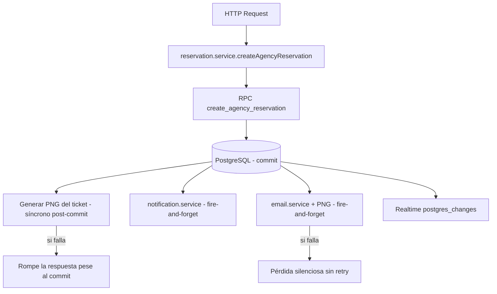
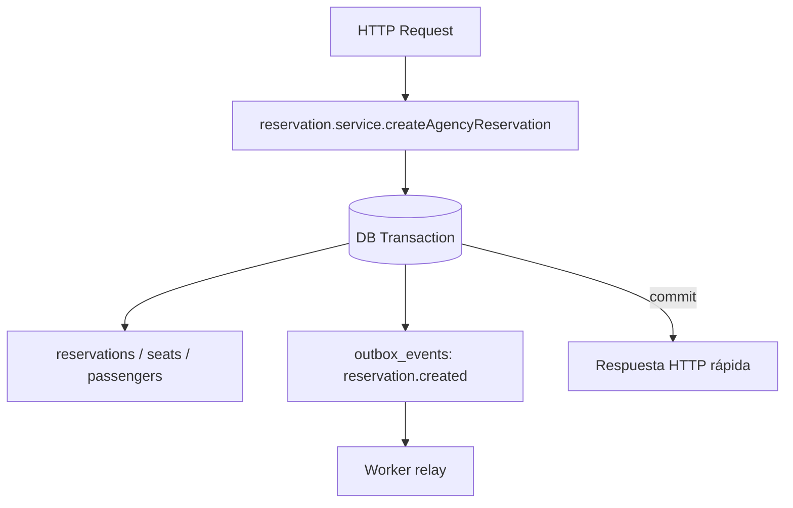
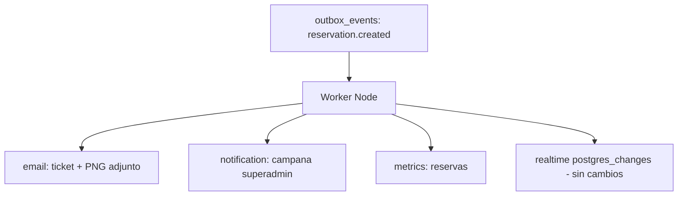

# WKR-003.1 — Outbox Implementation Readiness Audit

**Tipo:** Auditoría de preparación (solo análisis, sin implementación)
**Fecha:** 2026-08-05
**Referencia:** [WKR-001](WKR-001-event-inventory-audit.md), [WKR-002](WKR-002-events-workers-architecture-adr.md), [ADR-001](decisions/ADR-001-boarding-cross-agency.md), [ROADMAP.md](ROADMAP.md) Fase 3
**Decisión arquitectónica vigente:** Transactional Outbox + Workers independientes (WKR-002)

---

# 1. Objetivo

Esta auditoría determina **cómo** implementar correctamente el Transactional Outbox en Nómadas Tour, sin implementarlo.

## Qué es

- Un inventario detallado de las operaciones de dominio candidatas a emitir eventos.
- Un análisis del flujo actual del evento piloto (`reservation.created`) para dimensionar el cambio.
- La definición inicial del contrato, payload, idempotencia y side effects a mover.
- Los riesgos, dependencias y la estrategia de migración incremental.

## Qué decisiones busca habilitar

- Elegir el **primer evento** a implementar (recomendación: `reservation.created`).
- Definir la **forma de publicar** eventos (service layer vs trigger SQL vs RPC) en la fase de implementación.
- Decidir el **alcance de WKR-003** (tabla `outbox_events` + publicador + relay/dispatcher).
- Decidir **qué side effects** salen del ciclo HTTP y en qué orden.

## Qué NO hace

- No modifica código.
- No crea migraciones.
- No implementa el outbox ni workers.
- No agrega dependencias.
- No elige aún el vehículo de dispatch (BullMQ/Redis vs Postgres-as-queue vs Edge Functions) — pendiente de WKR-003.

---

# 2. Inventario de operaciones candidatas a eventos

Servicios analizados: `reservation.service`, `trip.service`, `superadmin.service`, `notification.service`, `email.service`, `auth.service` y flujos de boarding (`boarding_toggle` RPC, `boarding-attempts.service`, `boarding.guard`).

| Operación | Evento candidato | Servicio origen | Prioridad |
|---|---|---|---|
| Reserva creada (`createAgencyReservation`) | `reservation.created` | reservation.service | **ALTA** |
| Reserva cancelada (`cancelAgencyReservation`) | `reservation.cancelled` | reservation.service | **ALTA** |
| Pasajero cancelado (`cancelPassenger`) | `passenger.cancelled` | reservation.service | Media |
| Viaje creado (`createTrip`) | `trip.created` | superadmin.service | **ALTA** |
| Viaje editado (no pospuesto) (`updateTrip`) | `trip.updated` | superadmin.service | Media |
| Viaje pospuesto (`updateTrip` + postpone) | `trip.postponed` | superadmin.service | **ALTA** |
| Viaje cancelado (`updateTripStatus`) | `trip.cancelled` | superadmin.service | **ALTA** |
| Viaje completado (`updateTripStatus` / `completeExpiredTrips`) | `trip.completed` | superadmin.service / trip.service | Media |
| Pasajero abordado (`boarding_toggle` RPC) | `passenger.boarded` | reservation.service (RPC) | **ALTA** |
| Pasajero desabordado (`boarding_toggle` RPC) | `passenger.unboarded` | reservation.service (RPC) | **ALTA** |
| Agencia creada (`createAgency`) | `agency.created` | superadmin.service | Media |
| Usuario invitado (`createAgency`) | `user.invited` | superadmin.service | Media |
| Usuario activado (`acceptInvitation`) | `user.activated` | auth.service | Media |

### Observaciones

- **`trip.created`, `trip.postponed`, `trip.cancelled`** ya envían emails en loop por agencia dentro del request (`superadmin.service.ts:477-507`, `:1066-1095`, `:1298-1326`): el evento desacoplaría el fan-out.
- **`passenger.boarded` / `passenger.unboarded`** ocurren dentro de la transacción SQL `boarding_toggle` (046): requieren emisión atómica dentro del RPC o un trigger, no solo el service layer.
- **`trip.updated`** hoy es **silenciosa** (no emite email ni notificación): el evento habilita auditoría y avisos sin cambiar el dominio.
- **`reservation.cancelled`** hoy no envía email al booker: el evento lo habilita.
- `notification.service` y `email.service` **no son origen de eventos**: son consumidores finales (proyecciones de los hechos de dominio).

---

# 3. Primer evento recomendado

**Recomendación: `reservation.created`.**

### Análisis de candidatos

| Candidato | Impacto | Side effects actuales | Riesgo de inconsistencia | Facilidad de prueba | Veredicto |
|---|---|---|---|---|---|
| `reservation.created` | Alto (venta + ticket) | Email, PNG, notificación, realtime | **Alto** (PNG post-commit, email fire-and-forget) | Alta | **Elegido** |
| `trip.created` | Alto | Email loop, notificación | Medio | Media | Segundo |
| `passenger.boarded` | Alto | Logs, realtime | Bajo (ya transaccional) | Media | Después |
| `trip.cancelled` | Alto | Email loop, notificación | Medio | Media | Después |

### Justificación de `reservation.created`

1. **Alto impacto:** es el hecho comercial central — "se vendió un viaje con pasajeros y asientos". Su consumo fiable garantiza la entrega del ticket, la notificación al superadmin y las métricas.
2. **Múltiples side effects hoy:** ticket PNG, email (opt-in), notificación, realtime, actualización de `ticket_email_sent_at` (`reservation.service.ts:180-240`).
3. **Riesgo de inconsistencia real:** el PNG se genera **después del commit** (`:170`); si falla, rompe la respuesta aunque la reserva ya exista. El email es fire-and-forget con *unhandled rejection* (`:224-239`): una reserva confirmada puede quedar sin ticket entregado y sin retry.
4. **Fácil de probar:** flujo determinista (RPC atómico → evento → consumidor), sin dependencias de cron, con casos cubiertos por tests existentes de `reservation.service`.

---

# 4. Análisis del flujo actual de reservation.created

### Flujo actual (crear reserva → persistencia → side effects)

1. Validación de viaje activo, asignación de agencia, capacidad y disponibilidad.
2. `RPC create_agency_reservation` (014/047): transacción atómica que inserta reserva, pasajeros y reserva asientos con `SELECT ... FOR UPDATE`.
3. Generación de QR y relectura de la reserva completa.
4. **Notificación** `reservation_created` → superadmin (fire-and-forget).
5. Update de flags `contact_email` / `send_ticket_email`.
6. **Email del ticket** con PNG (fire-and-forget, guard `ticket_email_sent_at`).
7. Realtime: la inserción en `reservations`/`reservation_passengers`/`seats` dispara `postgres_changes` al frontend.

### Diagrama — Antes



### Problemas concretos identificados

- El commit ya ocurrió cuando se ejecutan PNG/email/notificación: un fallo no puede revertir la reserva.
- El email y el PNG comparten promesa; el `.then` interno no está enlazado al `.catch` externo (`:224-239`) → fallo no logueado.
- No hay reintento ni cola: el estado "reserva confirmada" y "ticket entregado" se tratan como un solo paso fallible.

---

# 5. Diseño futuro esperado

### Diagrama — Después (producción de eventos)



### Diagrama — Worker (consumo)



### Cambios clave

- El request solo persiste la reserva + el evento en la misma transacción; no renderiza ni envía nada.
- El worker es el único que renderiza PNG, envía email y crea la notificación (con retry e idempotencia).
- El realtime **no cambia**: sigue siendo `postgres_changes` sobre las tablas publicadas (complemento, no competidor).
- `ticket_email_sent_at` pasa a escribirlo el worker (idempotente), no el request.

---

# 6. Definición inicial del payload del evento

### Ejemplo — `reservation.created`

```json
{
  "event_id": "8f2a1c6e-9b3d-4c5e-8a1f-6d2b4e9c0a11",
  "event_type": "reservation.created",
  "aggregate_type": "reservation",
  "aggregate_id": "res-0001",
  "agency_id": "ag-0001",
  "trip_id": "trip-0001",
  "reservation_id": "res-0001",
  "occurred_at": "2026-08-05T14:30:00.000Z",
  "payload": {
    "booker_name": "Juan Pérez",
    "passenger_count": 2,
    "seat_ids": ["seat-0001", "seat-0002"],
    "seat_codes": ["A1", "A2"],
    "send_ticket_email": true,
    "contact_email": "cliente@correo.com",
    "route": { "origin": "Maracaibo", "destination": "Caracas" },
    "departure_time": "2026-08-10T07:00:00.000Z",
    "vehicle_type": "bus"
  }
}
```

### Datos necesarios

- Identidad del hecho: `event_id`, `event_type`, `aggregate_type`, `aggregate_id`, `occurred_at`.
- Contexto multi-tenant y de navegación: `agency_id`, `trip_id`, `reservation_id`, `actor_id` (quién ejecutó la acción).
- Datos para el consumidor: `booker_name`, `passenger_count`, `seat_ids`/`seat_codes`, `contact_email`, `send_ticket_email`, `route`, `departure_time`, `vehicle_type`.

### Datos que NO deben incluirse

- **Documentos de identidad** (`booker_document`, `passenger.document`): datos sensibles innecesarios para email/notificación/métricas. El worker lee lo que falte por `reservation_id` si lo requiere.
- **Teléfonos** de booker/pasajeros (a menos que un consumidor futuro de SMS lo justifique — hoy no existe).
- **PNG / QR data URL** y contenido del ticket: artefactos derivados, no hechos. El worker los regenera.
- **Datos de la cola** (estado, attempts, last_error): pertenecen a la tabla `outbox_events`, no al payload.

### Principio

El payload transporta el **hecho** y el **contexto de ruteo**, no los documentos de entrega ni datos personales innecesarios. La persistencia de datos sensibles sigue en las tablas de dominio (fuente de verdad); el worker consulta por `reservation_id` cuando necesita más detalle.

---

# 7. Multi-tenancy y seguridad

### Contexto que debe viajar en el evento

| Campo | Propósito |
|---|---|
| `agency_id` | Agencia **propietaria comercial** de la reserva (`reservations.agency_id`) |
| `trip_id` | Viaje afectado (para autorización operacional vía `trip_agencies`) |
| `actor_id` | Usuario que ejecutó la acción (auditoría y trazabilidad) |
| `operator_agency_id` | Para `passenger.boarded`/`unboarded`: agencia que escaneó (distinta de la propietaria) |

### Compatibilidad con ADR-001 (separación comercial/operacional)

- **Comercial:** la agencia propietaria (`reservations.agency_id`) administra la reserva. El evento `reservation.created` transporta esta agencia como `tenantId`.
- **Operacional:** el boarding de viajes compartidos lo opera la agencia asignada en `trip_agencies`. El evento `passenger.boarded` debe distinguir `operator_agency_id` (quién escaneó) de la propietaria.
- Notificaciones y reportes del worker se dirigen por propiedad comercial; la autorización de boarding sigue gobernada por `boarding.guard.ts` y el RPC `boarding_toggle`.

### RLS actual

- El backend accede con `supabaseAdmin` (service_role, BYPASSRLS), igual que el worker futuro.
- La autorización de negocio vive en la capa de aplicación (servicios + RPC), no en RLS para service_role.
- `outbox_events` (futura) NO debe publicarse en realtime ni exponerse al cliente; acceso solo vía service_role.
- Los payloads pueden contener `contact_email` (para el email del ticket): la tabla outbox debe quedar fuera del alcance del frontend y con RLS que solo permita service_role.

---

# 8. Idempotencia requerida

### Escenarios a cubrir

| Escenario | Qué puede pasar sin idempotencia | Qué debe pasar con idempotencia |
|---|---|---|
| Worker procesa dos veces | Email duplicado al booker | Un solo envío |
| Email falla (Resend error) | Pérdida del ticket sin retry | Reintento con backoff hasta completar |
| Proceso muere a mitad del envío | Reproceso o pérdida indefinida | Reanudar desde el evento sin duplicar el efecto |

### Propuesta

- **`event_id` único** por fila de `outbox_events` (UUID, UNIQUE) — identidad del hecho.
- **Registro de procesamiento por consumidor:** el worker registra `(consumer, event_id)` en su tabla de idempotencia (o actualiza `outbox_events.status = completed` + `processed_at`) **después** de completar el efecto externo.
- **Estados del evento:**

```
pending ──► processing ──► completed
              │
              └──► failed (tras agotar intentos) ──► DLQ (futuro)
```

- **Guard de negocio existente que se conserva:** `ticket_email_sent_at` (solo actualizable cuando es `null`) sigue siendo el *guard* de último recurso del email del ticket; el worker lo escribe tras un envío exitoso.

### Regla

Un evento **puede entregarse más de una vez**; el consumidor debe ser **idempotente**: el mismo `(consumer, event_id)` produce el mismo resultado sin efectos duplicados.

---

# 9. Side effects candidatos a mover

| Side effect | Actualmente | Futuro |
|---|---|---|
| Email de ticket (`reservation.created`) | Fire-and-forget en el request (`reservation.service.ts:224-239`) | **MOVER** → EmailWorker (retry + idempotencia) |
| Generación de ticket PNG | Síncrona post-commit en el request (`:170`) y dentro del email | **MOVER** → EmailWorker (bajo demanda) |
| Notificaciones in-app (`reservation_created`, `trip_*`, `passenger_*`) | Inserts best-effort en el request (`notification.service.ts:62-77`) | **MOVER** → NotificationFanoutWorker |
| Emails masivos de viajes (asignado/pospuesto/cancelado) | Loop por agencia en el request (`superadmin.service.ts:477-507`, `:1066-1095`, `:1298-1326`) | **MOVER** → EmailWorker (fan-out fiable) |
| Emails de invitación / registro / reset | Fire-and-forget en el request | **MOVER** (fase posterior) |
| Transacciones críticas (crear reserva, RPC) | Síncronas (requerido) | **MANTENER** síncrono |
| Liberación de locks | `setInterval` + Edge Function (cron no versionado) | **MOVER** → SchedulerWorker (WKR-005, no en WKR-003) |
| Auto-completado de viajes | `setInterval` en `index.ts` | **MOVER** → SchedulerWorker (WKR-005) |
| Boarding RPC (`boarding_toggle`) | Síncrono transaccional | **MANTENER** síncrono (solo emite evento) |
| Realtime (`postgres_changes`) | Síncrono del lado Supabase | **MANTENER** sin cambios |

### Prioridad de movimiento

1. **Emails + PNG del ticket** (WKR-003): elimina la pérdida silenciosa.
2. **Notifications** (WKR-003/004): elimina los inserts best-effort.
3. **Emails masivos de viajes** (WKR-004): elimina la latencia proporcional al número de agencias.
4. **Schedulers** (WKR-005): durabilidad de cron.

---

# 10. Riesgos de implementación

| Riesgo | Descripción | Mitigación |
|---|---|---|
| **Duplicación de emails** | Reproceso entrega el mismo email dos veces | Idempotencia `(consumer, event_id)` + guard `ticket_email_sent_at` |
| **Eventos duplicados** | Dos filas para el mismo hecho (publicación duplicada) | `event_id` UUID generado por el productor; UNIQUE constraint; correlación `(event_type, aggregate_id, occurred_at)` |
| **Cambios en tests** | Tests de `reservation.service`/`superadmin.service` asumen side effects síncronos | Ajustar mocks a la nueva interfaz; añadir tests de contrato del evento y del consumidor |
| **Consistencia eventual** | El email puede llegar con retraso respecto al commit | Documentar SLA; el ticket siempre se puede regenerar desde `reservation_id`; estado visible en outbox |
| **Migración gradual** | Riesgo de romper flujos existentes durante la transición | Fases (sección 11): outbox sin consumidores primero; toggle de escritura dual; worker detrás de feature flag |
| **Crecimiento de la tabla** | `outbox_events` acumula filas | Índice `(status, available_at)`; RetentionWorker (purga de `completed` tras 30-90 días) |
| **Origen del commit** | El RPC `create_agency_reservation` hace el commit; el service layer no tiene transacción propia | Emitir el evento dentro del RPC o con trigger sobre la fila insertada (decisión de WKR-003); nunca insertar outbox en un request separado |
| **Datos sensibles en outbox** | Payload con `contact_email` fuera del alcance del frontend | Tabla fuera de realtime; RLS solo service_role; mínimo de datos personales en payload |

---

# 11. Estrategia de migración incremental

### Fase 1 — Outbox sin consumidores

- Crear tabla `outbox_events` (diseño de WKR-002, sección 5) con índices y RLS.
- Publicador `publishEvent()` en el service layer, **sin workers**: solo inserta.
- Sin cambios de comportamiento: nada se mueve todavía.
- Verificación: tests de inserción; la tabla crece solo en staging.

### Fase 2 — Emitir `reservation.created`

- Publicar `reservation.created` en el mismo commit de la reserva (RPC o trigger).
- **Escritura dual:** mantener los side effects actuales (sincrónicos) y, en paralelo, registrar el evento.
- Feature flag: si la publicación falla, no romper la reserva (log + metric).
- Verificación: conteo de eventos emitidos vs reservas creadas (sin drift).

### Fase 3 — Worker procesa emails

- Primer worker consume `reservation.created`.
- **Toggle de consumo:** cuando el worker está sano y verificado, **apagar** el email/PNG/notificación sincrónicos del request y dejar que el worker los ejecute.
- Idempotencia verificada en staging con inyección de fallos (email falla, proceso muere a mitad).
- Verificación: reserva confirmada → ticket entregado exactamente una vez.

### Fase 4 — Mover más eventos

- Repetir el patrón para `reservation.cancelled`, `trip.created`, `trip.postponed`, `trip.cancelled`, `passenger.boarded`/`unboarded`.
- Emitir dentro de los RPC `boarding_toggle` / `create_agency_reservation` cuando corresponda.
- Mover schedulers a worker (WKR-005).
- Verificación: matrices de eventos emitidos vs operaciones en producción.

---

# 12. Dependencias necesarias

### Nuevas tablas

- `outbox_events` (diseño en WKR-002, sección 5) + índice `(status, available_at)`.
- Tabla de idempotencia del consumidor (o registro de `processed` por evento).
- (Futuro) `outbox_events_dead` para DLQ.

### Nuevos módulos

- `backend/src/events/` — tipos, contrato `DomainEvent`, `publishEvent`.
- `backend/src/jobs/` — estructura del worker (email, notifications) y relay/dispatcher.
- Módulo de configuración del worker (env, arranque, shutdown graceful).

### Nuevo proceso worker

- `nomadas-worker`: proceso Node separado (mismo repo/stack) que hace de relay del outbox y de scheduler (WKR-005).
- Contrato de despliegue: mismo env vars que la API + flags de worker.

### Nuevas variables de entorno (sin implementar)

| Variable | Propósito |
|---|---|
| `WORKER_ENABLED` | Habilita el proceso worker |
| `OUTBOX_POLL_INTERVAL_MS` | Intervalo de polling del relay |
| `EVENT_MAX_ATTEMPTS` | Máximo de intentos por evento |
| `EVENT_BACKOFF_BASE_MS` | Base de backoff exponencial |
| `EVENT_DLQ_ENABLED` | Activa la DLQ |
| `RESERVATION_SYNC_EFFECTS_ENABLED` | Feature flag de escritura dual / apagado de side effects síncronos |

### No requerido en WKR-003

- Sin broker (Redis/BullMQ/Kafka).
- Sin cambios en el esquema realtime.
- Sin nuevas extensiones de Postgres (el outbox no requiere `pg_cron`; el relay es el worker).

---

# 13. Validación final

### Resumen

| Ítem | Resultado |
|---|---|
| Primer evento recomendado | `reservation.created` |
| Operaciones analizadas | 13 (ver sección 2) |
| Side effects identificados | Email ticket+PNG, notificaciones, emails masivos de viajes, schedulers, realtime |
| Side effects a mover primero | Email + PNG del ticket, notificaciones |
| Side effects a mantener síncronos | Transacciones críticas, RPC de boarding, realtime |
| Riesgos encontrados | Duplicación de emails/eventos, tests, consistencia eventual, migración gradual, crecimiento de outbox, origen del commit, datos sensibles |
| Estrategia | 4 fases incrementales con escritura dual y feature flags |

### Próximo paso recomendado

**WKR-003 — Implementación del Transactional Outbox Foundation:** tabla `outbox_events` (migración), módulo `publishEvent`, emisión de `reservation.created` dentro del commit (RPC o trigger), y el relay/dispatcher base. Sin workers de negocio todavía.

### Restricciones respetadas

- No se modificó código, no se crearon migraciones, no se implementó outbox ni workers, no se agregaron dependencias.
- Solo se creó `docs/WKR-003.1-outbox-readiness-audit.md`.
