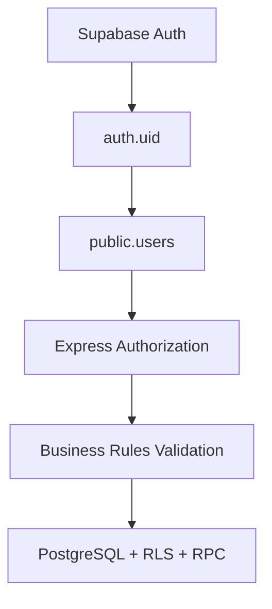

# Nómadas Tour — Security Hardening Implementation Plan

**Documento:** Plan técnico de implementación de remediaciones de seguridad  
**Basado en:** [Security Assessment C1–C4](security-audit-remediation.md)  
**Objetivo:** Eliminar vulnerabilidades críticas, reforzar límites de confianza y establecer un modelo seguro de autorización.  
**Última actualización:** 2026-08-01 (FASE 4 + validación manual forja completada)  
**Entorno:** Supabase producción (pre-lanzamiento). Migración 039 aplicada e validada.

---

## Resumen de progreso

| Task | Descripción | Hallazgo | Prioridad | Estado |
|------|-------------|----------|-----------|--------|
| SEC-001 | Auth middleware DB-backed | C1 | P0 | **Completado** |
| SEC-002 | Eliminar fabricación de identidad admin | C1 | P0 | **Completado** |
| SEC-003 | Revocar RPC pública de reservas | C3 | P0 | **Completado** |
| SEC-004 | RLS en `password_resets` | C2 | P1 | **Completado** |
| SEC-005 | Eliminar UPDATE directo de seats | C4 | P1 | **Completado** |
| SEC-006 | Reescribir políticas RLS | C1 | P2 | **Completado (v2)** |
| SEC-007 | Suite de regression tests | — | P2 | **Pendiente** |

**Migraciones relacionadas:**

| Archivo | Rol | Estado |
|---------|-----|--------|
| [`035_backfill_users_from_auth.sql`](../supabase/migrations/035_backfill_users_from_auth.sql) | FASE 0 — backfill `public.users` | Aplicada |
| [`037_revoke_rpc_public_execute.sql`](../supabase/migrations/037_revoke_rpc_public_execute.sql) | SEC-003 | Aplicada |
| [`036_rls_identity_from_public_users.sql`](../supabase/migrations/036_rls_identity_from_public_users.sql) | Intento RLS inline | **NO APLICAR** (42P17) |
| [`038_revert_036_rls.sql`](../supabase/migrations/038_revert_036_rls.sql) | Rollback de 036 | Aplicada |
| [`039_rls_identity_from_public_users_v2.sql`](../supabase/migrations/039_rls_identity_from_public_users_v2.sql) | SEC-005 + SEC-006 (v2) | **Aplicada en prod** |
| [`040_harden_password_resets.sql`](../supabase/migrations/040_harden_password_resets.sql) | SEC-004 — RLS + REVOKE en `password_resets` | **Aplicada en prod** |
| [`039_rollback_restore_metadata_rls.sql`](../supabase/migrations/039_rollback_restore_metadata_rls.sql) | Rollback de emergencia 039 | Disponible, no usado |

---

### Estado anterior (vulnerable)

```
Authentication
      |
      v
JWT Metadata (user_metadata — client-writable)
      |
      v
Authorization
      |
      v
Database Access
```

**Problema:** `user_metadata` es influenciable por el usuario y no debe usarse como fuente de autorización.

### Estado objetivo (hardening)



**Principios:**

- La identidad viene de Supabase Auth (`auth.uid()`).
- Los permisos vienen de `public.users`.
- Las reglas de negocio viven en el backend Express.
- La base de datos aplica aislamiento (RLS + RPC restringidas).
- El cliente nunca ejecuta operaciones privilegiadas directamente.

---

## 2. Fase P0 — Critical Security Fixes

**Prioridad:** Primera  
**Objetivo:** Eliminar vulnerabilidades explotables actualmente.

---

### TASK SEC-001 — Migrar autorización desde `user_metadata` a `public.users`

**Relacionado:** C1 · **Prioridad:** P0 · **Estado:** Completado

#### Problema original

```
JWT
 |
 v
user_metadata.role
 |
 v
req.ctx.role
 |
 v
authorize()
```

El usuario controlaba el origen del permiso.

#### Implementación

**Archivo:** [`backend/src/middlewares/auth.ts`](../backend/src/middlewares/auth.ts)

Flujo nuevo:

```
JWT válido
 |
 v
Supabase getUser()
 |
 v
auth.uid()
 |
 v
SELECT public.users (supabaseAdmin)
 |
 v
req.ctx
```

`extractContext()` lee `id, role, agency_id` desde `public.users`. No usa `user_metadata`.

#### FASE 4 — Frontend + `GET /auth/me`

**Estado:** Completado

Flujo unificado:

```
Supabase Auth (session / auth.uid)
        ↓
public.users (backend GET /auth/me)
        ↓
AuthProvider → useAuthUser()
        ↓
Consumidores (AuthNav, layouts, NotificationProvider, agency pages)
```

**Backend:** [`backend/src/routes/auth/index.ts`](../backend/src/routes/auth/index.ts)

- `GET /auth/me` — `auth` middleware + `meLimiter` (60 req/min)
- Login/invites mantienen `strictLimiter` (15/15min)

**Frontend:**

| Componente | Rol |
|------------|-----|
| [`components/auth/AuthProvider.tsx`](../components/auth/AuthProvider.tsx) | Única fuente compartida; dedup de `/auth/me` |
| [`hooks/useAuthUser.ts`](../hooks/useAuthUser.ts) | Re-export del contexto |
| [`components/auth/AuthRoleGuard.tsx`](../components/auth/AuthRoleGuard.tsx) | Redirects UX por rol (no frontera de seguridad) |
| [`middleware.ts`](../middleware.ts) | Solo validación de sesión Supabase |

**Validación manual (forja metadata):** ✅ **Completada 2026-08-01** (cuenta agency, prod pre-lanzamiento)

Prueba básica (browser):

1. Login agency → `/agency/trips` OK
2. Navbar sin enlace "Admin"
3. Navegar a `/admin` → bloqueado; `/agency/trips` sigue accesible sin re-login

Prueba de forja (consola + `PUT /auth/v1/user`):

```js
// Forjar metadata (Supabase acepta el cambio — vector de ataque simulado)
data: { role: 'superadmin', agency_id: null }
```

Resultados observados (todos esperados):

| Check | Resultado |
|-------|-----------|
| `user_metadata.role` = `superadmin` tras forja | OK (ataque simulado exitoso a nivel metadata) |
| `GET /auth/me` → `"role": "agency"` | OK — lee `public.users` |
| Navbar sin enlace Admin tras reload | OK |
| `/admin` bloqueado tras reload | OK |
| `GET /api/admin/dashboard` → 403 | OK |

**Conclusión:** ninguna capa (frontend, `/auth/me`, Express) confía en metadata forjada.

**Archivo complementario:** [`backend/src/middlewares/tenant.ts`](../backend/src/middlewares/tenant.ts) — valida membresía agency en DB (`dbUser.agency_id === agencyId`).

**Migración previa:** [`035_backfill_users_from_auth.sql`](../supabase/migrations/035_backfill_users_from_auth.sql) — garantiza fila en `public.users` antes del corte.

#### Validación esperada

| Escenario | Antes | Después |
|-----------|-------|---------|
| Usuario modifica metadata a `superadmin` vía API | 200 OK | 403 Forbidden (Express ignora metadata) |

#### Estado actual

- FASE 0 (035), FASE 1 backend y FASE 4 frontend implementadas.
- Validación manual browser + forja metadata: **OK (2026-08-01)**.
- Tests automatizados: [`backend/src/middlewares/auth.test.ts`](../backend/src/middlewares/auth.test.ts), [`tenant.test.ts`](../backend/src/middlewares/tenant.test.ts), [`auth.service.test.ts`](../backend/src/services/auth.service.test.ts) (`getMe`).

---

### TASK SEC-002 — Eliminar fabricación de identidad administrativa

**Relacionado:** C1 · **Prioridad:** P0 · **Estado:** Completado

#### Archivo

[`backend/src/services/auth.service.ts`](../backend/src/services/auth.service.ts)

#### Problema original

```
No existe public.users + metadata.role = superadmin => usuario privilegiado
```

#### Cambio

Eliminado fallback de fabricación. Comportamiento actual:

```typescript
if (userError || !dbUser) {
  throw new UnauthorizedError('Usuario no encontrado');
}
```

#### Validación

Usuario en `auth.users` sin fila en `public.users` → login falla.

#### Estado actual

Implementado. Login resuelve identidad solo desde `public.users`.

---

### TASK SEC-003 — Revocar RPC pública de reservas

**Relacionado:** C3 · **Prioridad:** P0 · **Estado:** Completado

#### Problema original

```
PUBLIC / anon / authenticated
 |
 v
create_agency_reservation()  (SECURITY DEFINER)
```

#### Migración

[`037_revoke_rpc_public_execute.sql`](../supabase/migrations/037_revoke_rpc_public_execute.sql)

- `REVOKE EXECUTE` de `create_agency_reservation` para `PUBLIC`, `anon`, `authenticated`
- `GRANT EXECUTE` a `service_role`
- `DROP FUNCTION create_superadmin` (bootstrap inseguro)

#### Validación

| Actor | Acción | Resultado esperado |
|-------|--------|-------------------|
| anon | `POST /rest/v1/rpc/create_agency_reservation` | 403 / 404 |
| Backend (service_role) | Crear reserva de agencia | SUCCESS |

#### Estado actual

Aplicada. Backend invoca RPC vía `supabaseAdmin` exclusivamente.

---

## 3. Fase P1 — Database Hardening

---

### TASK SEC-004 — Activar RLS en `password_resets`

**Relacionado:** C2 · **Prioridad:** P1 · **Estado:** Completado (040 aplicada en prod, validada)

#### Análisis previo (auditoría repo)

**Estructura de tabla** ([`024`](../supabase/migrations/024_password_resets.sql) + [`025`](../supabase/migrations/025_password_resets_failed_attempts.sql)):

| Columna | Tipo | Sensibilidad |
|---------|------|--------------|
| `id` | UUID PK | Identificador interno |
| `user_id` | UUID FK → `auth.users` | Vincula reset a cuenta |
| `code_hash` | TEXT | **Alta** — hash SHA-256 del código de 6 dígitos |
| `token` | TEXT UNIQUE | **Alta** — link directo de reset |
| `expires_at` | TIMESTAMPTZ | Ventana de validez |
| `used_at` | TIMESTAMPTZ | Consumo del token |
| `created_at` | TIMESTAMPTZ | Auditoría |
| `failed_attempts` | INT | Lockout anti brute-force |

**Policies existentes:** ninguna (RLS deshabilitada).

**Grants en repo:** ningún `GRANT` explícito en migraciones; Supabase puede otorgar defaults a `anon`/`authenticated` en la instancia viva.

**Riesgo:** exposición de `token`/`code_hash` vía PostgREST → account takeover (C2).

**Flujo backend** ([`auth.service.ts`](../backend/src/services/auth.service.ts)) — solo `supabaseAdmin` (service_role):

| Método | Operaciones en `password_resets` |
|--------|----------------------------------|
| `forgotPassword` | DELETE expirados, UPDATE invalidar previos, INSERT nuevo registro |
| `resetPassword` | SELECT por `code_hash` o `token`, UPDATE `used_at` |

Frontend/middleware: **sin referencias** a `password_resets`.

#### Migración

[`040_harden_password_resets.sql`](../supabase/migrations/040_harden_password_resets.sql):

```sql
REVOKE ALL ON TABLE public.password_resets FROM anon, authenticated, PUBLIC;
ALTER TABLE public.password_resets ENABLE ROW LEVEL SECURITY;
```

Sin policies para clientes → deny-all; `service_role` opera vía BYPASSRLS.

#### Validación esperada

| Caso | Actor | Acción | Resultado |
|------|-------|--------|-----------|
| 1 | authenticated `select('*')` | DENIED | OK |
| 2 | anon | DENIED | OK |
| 3 | Backend forgot/reset password | OK | OK |
| 4 | Flujo E2E recuperación | OK | OK |

#### Estado actual

- Migración **040** aplicada y validada en prod.
- Cliente sin acceso; backend `supabaseAdmin` operativo.
- **Fuera de alcance SEC-004:** incremento de `failed_attempts` en intentos inválidos (audit C2 — tarea separada).

---

### TASK SEC-005 — Eliminar UPDATE directo de seats

**Relacionado:** C4 · **Prioridad:** P1 · **Estado:** Completado

#### Problema original

```
Client → supabase.from('seats').update() → Database
```

#### Flujo objetivo (ya en producción)

```
Client → Express API → Reservation Service → Database (service_role)
```

Agency reservas: [`useSeatLocking`](../hooks/useSeatLocking.ts) → `agencyApi.lockSeat` / `unlockSeat` / `unlockAllSeats` → `/agency/seats/*`.

#### Auditoría frontend (2026-08-01)

| Archivo | Mutación directa | Usado en app |
|---------|------------------|--------------|
| `hooks/useRealtimeSeats.ts` | `updateSeatStatus()` → `.update()` | **No** (código muerto, 0 imports) |
| `hooks/useSeatLocking.ts` | Ninguna — solo API Express | Sí — [`app/agency/reservations/new/page.tsx`](../app/agency/reservations/new/page.tsx) |
| `lib/realtime/subscriptions.ts` | Solo subscribe UPDATE events | Sí — lectura/realtime |
| Resto `app/`, `components/` | 0× `supabase.from('seats')` | — |

**Conclusión:** `updateSeatStatus` eliminable sin reemplazo; el flujo activo ya usa backend.

#### Cambios en base de datos (039 PART 3)

```sql
DROP POLICY IF EXISTS "seats_auth_update" ON public.seats;
REVOKE UPDATE ON public.seats FROM anon, authenticated;
```

#### Cambios frontend

- **Eliminado:** [`hooks/useRealtimeSeats.ts`](../hooks/useRealtimeSeats.ts) (único sitio con `.update()` en seats; sin consumidores).

#### Validación

| Check | Resultado |
|-------|-----------|
| Frontend no muta seats vía Supabase | OK — 0 referencias `from('seats')` en app/hooks/components |
| Realtime OK | OK — `useSeatLocking` + `subscribeToTripSeats` sin cambios |
| Selector / reserva OK | OK — lock/unlock vía `agencyApi` |

---

## 4. Fase P2 — Arquitectura de seguridad

---

### TASK SEC-006 — Reescribir políticas RLS

**Relacionado:** C1 · **Prioridad:** P2 · **Estado:** Completado (v2)

#### Objetivo

Eliminar `auth.jwt() -> 'user_metadata'` de todas las policies de autorización.

#### Plan original (descartado en prod)

```sql
EXISTS (SELECT 1 FROM public.users u WHERE u.id = auth.uid() AND u.role = '...')
```

#### Implementación real (039 v2)

Patrón con helpers `SECURITY DEFINER` en schema `private`:

```sql
(SELECT private.auth_app_role()) = 'agency'
AND agency_id = (SELECT private.auth_app_agency_id())
```

**Por qué no inline EXISTS:** la migración 036 produjo `SQLSTATE 42P17` (recursión infinita en policies de `public.users`). Ver sección 5.

#### Archivos

| Archivo | Estado |
|---------|--------|
| [`039_rls_identity_from_public_users_v2.sql`](../supabase/migrations/039_rls_identity_from_public_users_v2.sql) | Aplicada (incremental: PART 0→1→2→3) |
| [`039_rollback_restore_metadata_rls.sql`](../supabase/migrations/039_rollback_restore_metadata_rls.sql) | Rollback disponible |
| [`036_rls_identity_from_public_users.sql`](../supabase/migrations/036_rls_identity_from_public_users.sql) | **NO APLICAR** |

#### Helpers PART 1

- `private.auth_app_role()` — lee `role` desde `public.users`
- `private.auth_app_agency_id()` — lee `agency_id` desde `public.users`
- `GRANT USAGE ON SCHEMA private TO authenticated, service_role`
- `GRANT EXECUTE ON FUNCTION ... TO authenticated`

#### Policies migradas

**STEP A (Realtime):** `agencies`, `notifications`, `reservations`, `reservation_passengers`, `boarding_logs` — incluye `reservations_agency_insert` y `bl_agency_insert`.

**STEP B (admin + C4):** `routes`, `trips`, `seats`, `trip_agencies`, `users`, `agency_notification_preferences`, `agency_invitations` (condicional).

**Sin tocar:** `*_public_read` (5 policies), publicaciones Realtime, frontend, backend.

#### Validación prod (2026-08-01)

| Check | Resultado |
|-------|-----------|
| Policies con `user_metadata` (autorización) | 0 filas |
| Policies con `public.users` inline | 0 filas |
| Lecturas públicas intactas | 5/5 |
| Helpers `private.*` | 2/2 |
| Realtime en app | OK, sin `CHANNEL_ERROR` |
| Snapshot pre-migración | 31 policies en `private.migration_039_policy_snapshot` |

---

### TASK SEC-007 — Auditoría automática de SECURITY DEFINER

**Prioridad:** P2 · **Estado:** Pendiente

#### Revisión obligatoria

```sql
SELECT proname, prosecdef
FROM pg_proc
WHERE prosecdef = true;
```

**Regla:** Toda función `SECURITY DEFINER` debe tener propietario conocido, permisos explícitos y validación de entrada.

#### Estado actual

- Revisión manual realizada para `create_agency_reservation` (037) y helpers `private.auth_app_*` (039).
- No existe suite automatizada ni carpeta `tests/security/`.

---

## 5. Incidente 036 → 038 → 039

### Qué pasó

1. **036** reescribió ~20 policies con `EXISTS (SELECT FROM public.users)` inline.
2. **Resultado:** `SQLSTATE 42P17` — recursión infinita detectada en policy de `public.users`.
3. **Efecto colateral:** Realtime dejó de funcionar en la mayoría de canales autenticados.
4. **038** restauró policies basadas en `user_metadata` → Realtime recuperado.
5. **039 v2** aplicó helpers `private.*` (SECURITY DEFINER) → sin recursión, Realtime OK.

### Causa raíz

Policies sobre `public.users` que consultan `public.users` inline crean un ciclo RLS. Cualquier policy con subquery a `users` hereda el ciclo cuando Postgres evalúa permisos.

### Lección aprendida

- No usar `EXISTS (SELECT FROM public.users)` directamente en policies de tablas que participan en cadenas RLS.
- Usar funciones `SECURITY DEFINER` con `SET search_path = ''` en schema `private`.
- Aplicar migraciones RLS **incrementalmente** (Realtime primero, validar, luego admin).
- Guardar inventario `pg_policies` antes del primer `DROP POLICY`.

### Rollback

[`039_rollback_restore_metadata_rls.sql`](../supabase/migrations/039_rollback_restore_metadata_rls.sql) — restaura estado post-038 + elimina helpers.

---

## 6. Security regression tests

**Estado:** Pendiente — no existe `tests/security/`.

| Test | Descripción | Estado |
|------|-------------|--------|
| 1 | Privilege escalation — metadata forjada no accede admin | ✅ Manual (2026-08-01) + backend tests |
| 2 | RPC exposure — anon no puede invocar `create_agency_reservation` | Manual / 037 aplicada |
| 3 | Tenant isolation — agencia A no ve reservas de B | Parcial (tenant.test.ts) |
| 4 | Seat manipulation — cliente no puede UPDATE seats | DB OK; falta test automatizado |

---

## 7. Orden exacto de implementación

| # | Task | Descripción | Estado |
|---|------|-------------|--------|
| 1 | SEC-001 | Auth middleware DB-backed + backfill 035 | ✅ |
| 2 | SEC-002 | Remove identity fabrication | ✅ |
| 3 | SEC-003 | Revoke RPC exposure (037) | ✅ |
| 4 | SEC-004 | Harden `password_resets` (040) | ✅ |
| 5 | SEC-005 | Remove seat client writes (039 + frontend) | ✅ |
| 6 | SEC-006 | Rewrite RLS policies (039 v2) | ✅ |
| 7 | SEC-007 | Security regression suite | ⬜ |

**Nota:** SEC-005 y SEC-006 se consolidaron en la migración 039 (no en archivos separados como `039_remove_client_seat_update.sql` del plan original).

---

## 8. Definition of Done

| Criterio | Estado |
|----------|--------|
| `user_metadata` no controla permisos en Express | ✅ |
| `user_metadata` no controla permisos en RLS | ✅ |
| `user_metadata` no controla permisos en frontend (AuthProvider + `/auth/me`) | ✅ |
| Middleware Next.js solo valida sesión (roles en layout) | ✅ |
| Ningún usuario escala privilegios modificando JWT metadata (API) | ✅ |
| Ninguna función SECURITY DEFINER pública sin justificación | ✅ (037 + 039) |
| `password_resets` no accesible desde clientes | ✅ |
| Seats solo modificables vía backend autorizado | ✅ |
| RLS usa fuentes confiables (`public.users` vía helpers) | ✅ |
| Validación manual forja metadata (browser + consola) | ✅ (2026-08-01) |
| Tests de seguridad automatizados (`tests/security/`) | ⬜ |
| Producción tiene grants auditados | ⚠️ Parcial (039 + GRANT USAGE manual) |

---

## 9. Pendientes pre-lanzamiento

### Alta prioridad

_(ninguno — middleware y frontend auth migrados en FASE 4)_

### Media prioridad

1. **SEC-007** — Crear `tests/security/` con tests 1–4 automatizados.
2. **Limpieza de claims** — Dejar de poblar `role`/`agency_id` en `user_metadata` en aceptación de invitación (opcional; backend ya ignora metadata).
3. **Custom Access Token Hook** — Defensa en profundidad opcional (Fase 3 del audit).

### Referencias

- Audit detallado: [`docs/security-audit-remediation.md`](security-audit-remediation.md)
- Rollback 039: [`supabase/migrations/039_rollback_restore_metadata_rls.sql`](../supabase/migrations/039_rollback_restore_metadata_rls.sql)

---

## Historial de aplicación en prod

| Fecha | Acción | Resultado |
|-------|--------|-----------|
| 2026-08-01 | PART 0+1 (039) — snapshot 31 policies + helpers | OK |
| 2026-08-01 | `GRANT USAGE ON SCHEMA private TO authenticated` | Fix manual (ahora en repo) |
| 2026-08-01 | STEP A (039) — Realtime policies | OK, Realtime validado |
| 2026-08-01 | STEP B (039) — admin + C4 seats | OK |
| 2026-08-01 | Validación PART 4 (queries 4.1–4.5 + app) | Todo OK |
| 2026-08-01 | 040 — RLS + REVOKE en `password_resets` | OK, forgot/reset validado |
| 2026-08-01 | SEC-005 — eliminado `hooks/useRealtimeSeats.ts` (código muerto) | OK |
| 2026-08-01 | FASE 4 — `GET /auth/me`, AuthProvider, middleware session-only | OK |
| 2026-08-01 | Validación manual — prueba browser + forja metadata (agency) | OK — todos los checks esperados |
